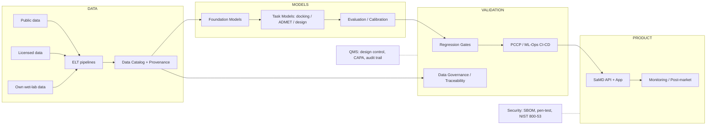

# 02-ARCHITECTURE — Therapeutic-AI

## System overview
Two coupled systems:
1. **Research platform** (Drug Discovery Engine) — fluid, iterative, scientific.
2. **SaMD product** — locked, validated, regulated.

The architectural spine connecting them is the **Regulated-AI validation pipeline** that makes PCCP (Predetermined Change Control Plan) operationally executable.

## High-level data flow

## Architectural principles (non-negotiable)
1. **Provenance everywhere** — every prediction traces to exact data + model version (FDA + scientific reproducibility).
2. **Locked vs. adaptive** — research models are fluid; SaMD-deployed models are frozen or advance only via authorized PCCP protocol.
3. **CI/CD-backed validation** — regression gates auto-run on every change; operationalized by the ML-Validation team.

## Component responsibilities

| Component | Owner team | Notes |
|---|---|---|
| Data catalog + lineage | Head of Data / Data Gov Engineer | Source, license, version, split (train/val/test) recorded |
| Foundation models | AI Research | Protein folding/co-folding, molecular generation |
| Task models | AI Research + ML Eng | Docking, ADMET, property prediction |
| Evaluation/calibration | ML Evaluation Scientists | Proper scoring, OOD detection, bias |
| Validation gates | ML-Validation | IEC 62304 V&V + regression |
| SaMD API + App | Platform Eng | Clinician-facing; cybersecurity hardened |
| QMS / CAPA | RA/QA | ISO 13485, design control, audits |
| Post-market monitoring | Clinical + ML-Validation | PCCP-consistent surveillance |

## Deployment / environments
- **Research**: fluid env — any model, any data split, no release gate.
- **Staging**: candidate release — runs full regression gates + validation suite.
- **Production (SaMD)**: locked release — frozen model weights; changes only via authorized PCCP protocol.

## Security & compliance posture
- FDA cybersecurity guidance for medical device software (SBOM, threat modeling, pen-test).
- NIST 800-53 controls; ISO 27001 alignment.
- HIPAA/PHI handling in clinical data flows.
- EU: MDR Class IIa+ via technical files; EU AI Act high-risk obligations (Aug 2026 / Dec 2027 as amended).

_This is v1 architecture; refined as Phase 2 engineering starts._